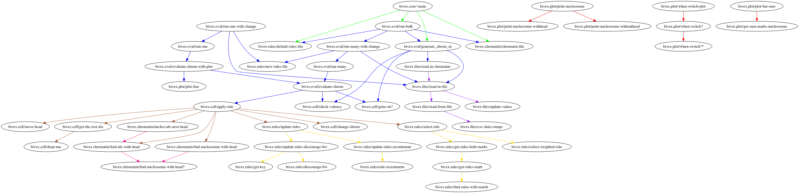

# clotree

[last updated 17/08/18]
[still under development]

A Clojure library designed to generate tree of functions to help visualise the network of functions under a project. Functions from each namespace is colored differently.

## Usage

FIXME

## License

Copyright © 2018 FIXME

Distributed under the Eclipse Public License either version 1.0 or (at
your option) any later version.
